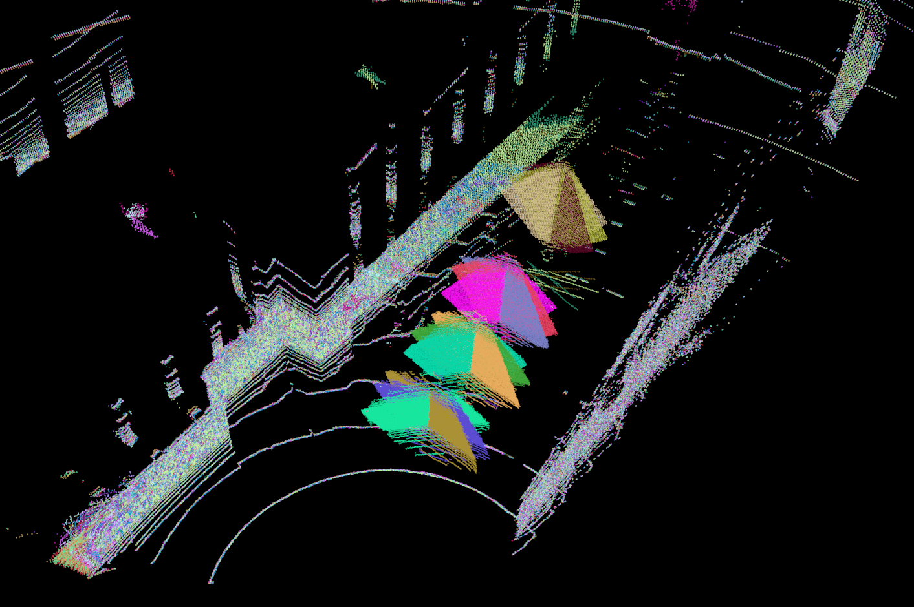

# lidar_camera_calibrator

lidar_camera_calibrator is a semi-automatic, high-precision, feature-based camera and LIDAR extrinsic calibration tool. In general, feature-based calibration methods often require some manual intervention, such as manually selecting feature points, using a calibration board with a fixed pattern, etc., resulting in a low degree of automation in this method. The lidar_camera_calibrator can semi-automatically calibrate high-precision extrinsic parameters and provide an interactive  Qt interface with less manual intervention.

Hope it helps you.


([中文说明](./README_CN.md))

- [lidar_camera_calibrator](#lidar_camera_calibrator)
  - [Dependencies](#dependencies)
  - [Build](#build)
  - [Test](#test)
  - [Usage](#usage)
    - [a. Prepare the Data](#a-prepare-the-data)
    - [b. Calibrate](#b-calibrate)
  - [TODO](#todo)
  - [License](#license)
  - [Acknowledgments](#acknowledgments)

## Dependencies

- ROS

- Qt 5 (system)

- Eigen 3 (3.3+)

- [ceres](https://github.com/ceres-solver/ceres-solver.git)（commit: e51e9b4）

  > ```bash
  > # ceres dependencies
  > $ sudo apt-get install  liblapack-dev libsuitesparse-dev libcxsparse3 libgflags-dev libgoogle-glog-dev libgtest-dev
  > ```

- [g2o](https://github.com/RainerKuemmerle/g2o.git)（tag: 20200410_git）

  > ```bash
  > # g2o dependencies
  > $ sudo apt-get install qt5-qmake qt5-default libqglviewer-dev-qt5 libsuitesparse-dev libcxsparse3 libcholmod3
  > ```

- [sophus](https://github.com/strasdat/Sophus.git)（commit: 13fb328）

## Build

```bash
$ mkdir -p ws_calibrator/src && cd ws_calibrator
$ git clone REPOSITORY_GIT_LINK src/lidar_camera_calibrator 
$ catkin_make
```

## Test

We have tested this tool on real and simulated Velodyne-16 and normal cameras, and test data is provided under the `data` folder.

Test video 1(with AprilTag)：[Youtube link](https://youtu.be/uew143NcVQw) , [Bilibili link](https://www.bilibili.com/video/BV1ML4y1s7Rm/)

Test video 2(without AprilTag)：[Youtube link](https://youtu.be/0UBl0rEK3ig)，[Bilibili link](https://www.bilibili.com/video/BV1s34y1y7X9/)

```bash
# Calibration using a calibration board with AprilTag(Simulation)
roslaunch lidar_camera_calibrator calibrate.launch 

# Calibration using a calibration board without AprilTag(Real)
roslaunch lidar_camera_calibrator calibrate.launch input_path:=`rospack find lidar_camera_calibrator`/data/data-hitsz 
```

## Usage

### a. Prepare the Data

- Calibration board: **rectangular board**(It is recommended to be about 1m*1m）

  > If there is a AprilTag marker like `data/data-sim` on the calibration board, the image features can be automatically extracted.

- Data collection:

  - During data collection, the calibration board should be placed obliquely, and **the left and right points of the board can not be on the same height**.

  - Collect data at different positions, it is recommended to get at least 4 pairs and include both far and near positions, as the following figure shows.

    

- Create calibration data

  We provide a script to get soft-synced LiDAR and camera data to calibrate.

  Modify the topic names of Point cloud and image in the `get_sync_data.launch`, and press the `space` button in the terminal to save current synchronized data.

  ```bash
  $ roslaunch lidar_camera_calibrator get_sync_data.launch
  ```

- Prepare the config.json

  Create a config.json and modify corresponding parameters in config.json according to `data/data-sim/config.json`.

  >Parameter Description in config.json
  >
  >```yaml
  >"cam": # Camera internal parameters
  >"lidar_pose":"descend" # "descend" means the LiDAR is placed upright relative to the camera and "ascend" means the LiDAR is placed upside-down relative to the camera. 
  >"pc": 
  >    "PerspectiveParams": # perspective of pcl_viewer
  >    "filter": # The following parameters represent an annular sector area, and the points inside the area will be used to extract the board point cloud.
  >           "angle_start":  # the starting angle
  >           "angle_size":   # the angle range
  >           "min_distance": # the inside radius
  >           "max_distance": # the outer radius
  >           "ceil_gap":     # the distance to the highest point of the point cloud
  >           "floor_gap":    # the distance to the lowest point of the point cloud
  >           "min_distance_threshold": # the upper limit of min_distance
  >           "max_distance_threshold": # the upper limit of max_distance
  >           "max_ceil_gap": # the upper limit of ceil_gap
  >           "max_floor_gap": # the upper limit of floor_gap
  >    "plane":  # parameters of extracting the board point cloud 
  >"size": # the number of sides of the calibratoin board
  >"tag_size": # the length, width and height of the calibration board
  >"tf": # the calibrated extrinsic parameters, which need to be saved by 'save result'
  >```

### b. Calibrate

1. Modify the `input_path` in the launch file to the absolute path of the prepared calibration data, then calibrate it according to the above tutorial. 

   ```bash
   $ roslaunch lidar_camera_calibrator calibrate.launch
   ```

2. Adjust the parameters in pointcloud control until the appropriate calibration board point cloud appears on the right, and then click `extract`. If the correct feature is extracted in the point cloud, click `next pose`, otherwise click `skip pose`.

3. If the calibration board is with AprilTag, the image control part will automatically extract the corner points. If the detection is wrong or the calibration board is without AprilTag, you need to click `start selection` and then select the four corner points in the image **sequentially**, and finally click ` finish selection`.

4. Repeat steps 2 and 3 until each pair of data is processed. Finally, click `calibrate`, and you can see the output of extrinsic parameters in the terminal. The calibration result can be evaluated qualitatively through `next pose` and `previous pose`, and the extrinsic parameter can be saved to config.json with `save result`.

## TODO
- [ ] to support online data collection visualized by Rviz and online calibration.

## License

lidar_camera_calibrator is released under [GPL-3.0 License](./LICENSE).

## Acknowledgments

In this project, the image feature extraction part refers to [AprilTag](https://github.com/AprilRobotics/apriltag), the point cloud feature extraction refers to [the work of Jiunn-Kai Huang](https://github.com/UMich-BipedLab/extrinsic_lidar_camera_calibration), and the Qt interface and framework parts refer to [plycal](https://github.com/ram-lab/plycal).

Many thanks for their work.

